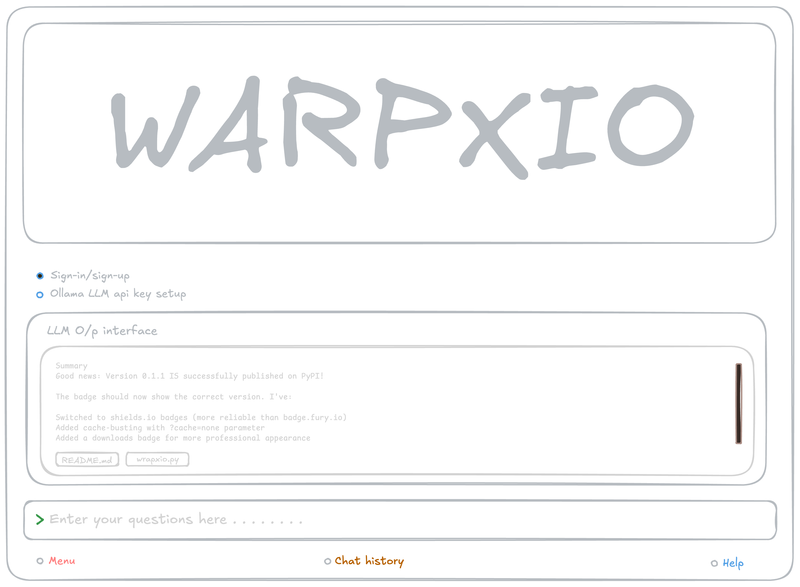

# WarpXIO

<p align="center">
  
</p>

<p align="center">
  <strong>Warpxio is an oepn source LLMs based code interface which can be used on your terminals</strong>
</p>

<p align="center">
  <em>Note: WarpXIO is not affiliated with WarpX, Cloudflare WARP, or other projects.</em>
</p>

<p align="center">
  <a href="https://pypi.org/project/warpxio/">
    
  </a>
  <a href="https://pypi.org/project/warpxio/">
    
  </a>
  <a href="https://pypi.org/project/warpxio/">
    
  </a>
</p>

## Installation

```bash
pip install warpxio
```

## Usage

```bash
warpxio generate "Write a Python script"
```

## Workspace Design idea

<p align="center">
  
</p>

---

<p align="center">
  <strong>WarpXIO © 2025, Roni Bhakta. All rights reserved.</strong>
</p>
